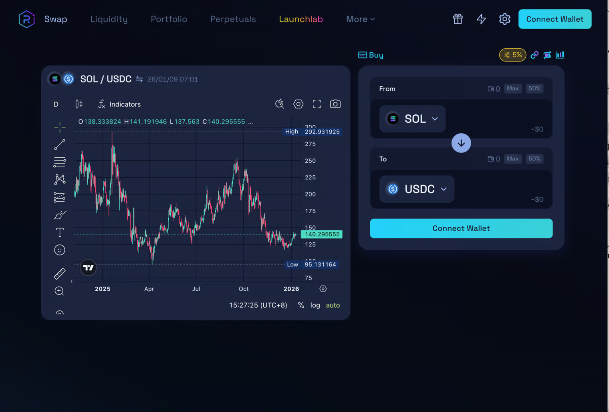

# Raydium Swap

Everything on Raydium runs at [raydium.io ](https://raydium.io/swap/)— no downloads needed.

You can swap tokens, trade perps with leverage, provide liquidity to earn fees, and launch or buy new tokens via LaunchLab.

Connect your wallet to get started.

<figure><figcaption></figcaption></figure>

